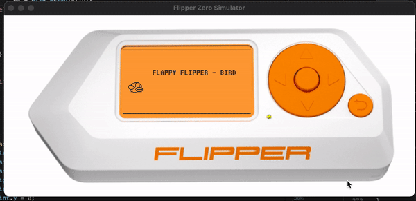

# Flipper UI Simulator

This is a very early prototype of a simulator to compile and run Flipper apps or games as native Windows or Linux applications.

Note that the `Flipper API` currently used does not yet match the API of the real firmware.

# Examples
Flappy Bird 
 


Snake

 

Tetris


# Compiling
## Linux 

Debian/Ubuntu:
```bash
apt install libsdl2-dev libsdl2-image-dev
mkdir build
cd build
cmake ..
make
```

## Windows

Use [vcpkg](https://github.com/microsoft/vcpkg) to install SDL2 and SDL2-image libraries. Also set `%VCPKG_ROOT%` to point to the vcpkg directory.

```
vcpkg.exe install sdl2:x64-windows sdl2-image:x64-windows
```
Generate Visual Studio project with CMake:
```
mkdir build
cd build
cmake -G "Visual Studio 15 2017 Win64" -DCMAKE_BUILD_TYPE=Release -DCMAKE_TOOLCHAIN_FILE=%VCPKG_ROOT%/scripts/buildsystems/vcpkg.cmake ..
```

Or, generate Ninja project with CMake:
```
mkdir build
cd build
cmake -G Ninja -DCMAKE_BUILD_TYPE=Release -DCMAKE_TOOLCHAIN_FILE=%VCPKG_ROOT%/scripts/buildsystems/vcpkg.cmake ..
```

## macOS

Make sure you have [homebrew](https://brew.sh) installed.

```
brew install cmake sdl2 sdl2_image
mkdir build
cd build
cmake ..
make
```
